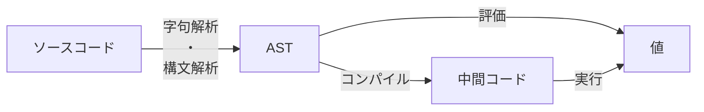

第1部では、ツリーウォーク式インタプリタ・中間コード式インタプリタというふたつの方式で小さなインタプリタを作ります（説明は後で）。小さいといってもインタプリタのエッセンスが詰まった章で、とても大きな学びになるはずです。

* 第1章 最小の評価器 (100行)
  ツリーウォーク式インタプリタのコア部分を作り、アルゴリズムを実行できるようにします。コア部分のみのため、入力はテキストではなく、配列やタプルといったデータ構造で表現する必要があります。この「配列やタプルといったデータ構造による表現」のことをASTと呼びます（詳細は後述）。
* 第2章：最小の字句解析・構文解析器 (300行)
  テキストのソースコードを読んでASTに変換する字句解析・構文解析器を作り、第1章の評価器で読めるようにします。評価器と組み合わせるとこれでもう小さなインタプリタになっています。
* 第3章：最小の中間コード式インタプリタ (500行)
  第2章の字句解析・構文解析器と、ASTを中間コードに翻訳するコンパイラ、その中間コードを実行する仮想マシンを組み合わせて、中間コード式インタプリタを作ります。

ここまでの構成を以下に示します。

SICPと呼ばれる伝説的名著『Structure and Interpretation of Computer Programs』（邦題：『計算機プログラムの構造と解釈』）のクライマックスは4章・5章なのですが、4章で説明しているのが評価器、5章で説明しているのが中間コード式インタプリタです。つまり第1部を読めばSICPの最も重要な部分が体験できるということです（言い過ぎ）。

最初のうちは説明しなくてはならないこと・したいことが多くてコードの規模の割に長い説明になっています。わかってそうなところはさらっと読み流して進んでいただいてかまいません。

では自作プログラミング言語始めましょう！
