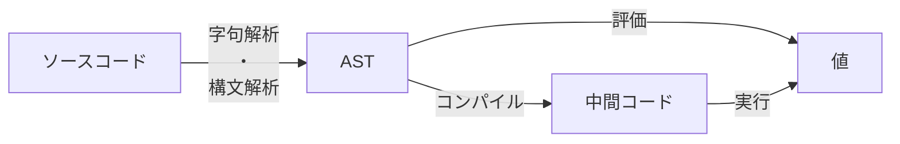

第 1 部では、ツリーウォーク式インタプリタ・中間コード式インタプリタというふたつの方式で小さなインタプリタを作ります（説明は後で）。小さいといってもインタプリタのエッセンスが詰まった章で、とても大きな学びになるはずです。

* 第 1 章　最小の評価器 (100 行)
  ツリーウォーク式インタプリタのコア部分を作り、アルゴリズムを実行できるようにします。コア部分のみのため、入力はテキストではなく、配列やタプルといったデータ構造で表現する必要があります。この「配列やタプルといったデータ構造による表現」のことを AST と呼びます（詳細は後述）。
* 第 2 章　最小の字句解析・構文解析器 (300 行)
  テキストのソースコードを読んで AST に変換する字句解析・構文解析器を作り、第 1 章の評価器で読めるようにします。評価器と組み合わせるとこれでもう小さなインタプリタになっています。
* 第 3 章　最小の中間コード式インタプリタ (500 行)
  第 2 章の字句解析・構文解析器と、AST を中間コードに翻訳するコンパイラ、その中間コードを実行する仮想マシンを組み合わせて、中間コード式インタプリタを作ります。

ここまでの構成を以下に示します。

SICP と呼ばれる伝説的名著『Structure and Interpretation of Computer Programs』（邦題：『計算機プログラムの構造と解釈』）のクライマックスは 4 章・5 章なのですが、4 章で説明しているのがツリーウォーク式インタプリタ、5 章で説明しているのが中間コード式インタプリタです。つまり第 1 部を読めば SICP の最も重要な部分が体験できるということです（言い過ぎ[^many-many-other-advanced-topics]）。

[^many-many-other-advanced-topics]: もちろん、当然、まったくもって言うまでもないことですが SICP には高度な話題がほかにもいっぱい書いてあります[^but]。

[^but]:でも SICP には字句解析と構文解析はありませんよ（負け惜しみ

最初のうちは説明しなくてはならないこと・したいことが多くてコードの規模の割に長い説明になっています。わかってそうなところはさらっと読み流して進んでいただいてかまいません。

では自作プログラミング言語始めましょう！
