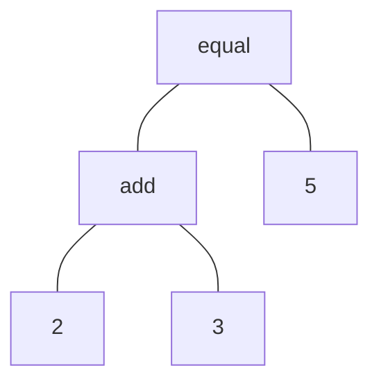

次は `+`・`==`・`print` に相当する関数を作ります。ただし、ここでは簡易版の関数を作り、あとでちゃんとした実装に作り直します。

作り直すのになぜ今作るのかというと・・・その方が実行例がわかりやすくなるからです。あと、いったん簡単な実装を見ておいた方がちゃんとした実装を見たときにわかりやすいだろう、という狙いもあります。

Toil では「式」をタプルで表すことにします。タプル？なにそれ？という方は、とりあえず配列のようにいくつかの値をまとめたものだと理解してください [^tuple]。配列で `[2, 3]` と書くものはタプルでは `(2, 3)` や単に `2, 3` のように書きます。

[^tuple]: 詳しく知りたい方は https://docs.python.org/ja/3/tutorial/datastructures.html#tuples-and-sequences をどうぞ。

なお、`[2, 3]` のようなものを Python では通常「リスト」と呼びますが、筆者は宗教上の問題からリストと呼ぶことにはどうしても抵抗があるので本書では配列と呼んでいきます。すみません。でもソースコード内では `list` と書かざるを得ないときもある。残念。

本格的に言語処理系を実装する場合は、クラスで表すことが多いのですが、Toil ではシンプルに書けてコンパクトに表示できるタプルを使います。コードを書くにも、デバッグなどで print などするにも、タプルの方が短くて済むので学習には便利です。

ここで作る簡易版の関数は `(<関数名>, [<式>, <式>, <式>, ...])` という形をとります。これからさまざまな「式」が出てきますが、タプルで表される式はすべてひとつめの要素でそのタプルが何であるかを表し、ふたつめの要素は処理対象を配列にまとめたものを置く、という約束にします。タプルを使ったり配列を使ったりしていて使い分けが気になる方はコラムをどうぞ。

たとえば `2 + 3`・`2 == 2`・`print(2)` といった式は以下のように表します。

```py
("add", [2, 3])
("equal", [2, 2])
("print", [2])
```

`[]` の中身は `2` や `3` のような単純な「式」ではなく、関数であってもかまいません。
このようなものも認められます。

```py
("add", [("add", [2, 3]), 4])
("print", [("equal", [("add", [2, 3]), 5])])
```

今回は先に実行例を見てみましょう。自分で入力している方は前回の実行例を丸ごと置き換えるなり、末尾に追加するなりしてください。GitHub においてあるソースでは前回の実行例を置き換えています。

```py
    # Example

    print("Pseudo Functions:")

    print(toil.eval(("add", [2, 3]))) # -> 5
    print(toil.eval(("equal", [2, 2]))) # -> True
    print(toil.eval(("equal", [2, 3]))) # -> False
    print(toil.eval(("print", [2]))) # -> 2\nNone

    toil.eval(("print", [("equal", [("add", [2, 3]), 5])])) # -> True
```

2 と 3 を足して 5、2 と 2 が等しいから True・・・となります。

最後の行はちょっとややこしいですね。内側から見ていって、まず 2 と 3 を足し、それが 5 と等しいかどうかを表示しています。普通のプログラム風に書くと `print(2 + 3 == 5)` を実行していることになります。より実行例に近づければ `print((2 + 3) == 5)` ですね。`eval()` が自分で `print` しているので、Python 側の `print` がないことにも注意してください。

どうですか？急に複雑なことができるようになって、プログラムが動いている感じがしてきませんか？

`print(toil.eval(("print", [2])))` の `# -> 2\nNone` というコメントは、まず `toil.eval(("print", [2]))` によって `2` が `print` され、その後次の行に `toil.eval(("print", [2]))` の値の `None` が表示されることを意味しています。`\n` はそこで行が終わるという意味で書いています。

実際の表示は以下のようになります。

```
$ python toil.py
Pseudo Functions:
5
True
False
2
None
True
```

コードを示します。

この先、本書では前章からの変更箇所を取り出して解説します。`+` で始まる行が追加された行を示します。行頭の `+` や `-` はその行に変更があったということを示すマークなので、ソースコードには入力しないでください。

```diff py
         match expr:
             case None | bool() | int(): return expr
+            case ("add", [a, b]): return self.eval(a) + self.eval(b)
+            case ("equal", [a, b]): return self.eval(a) == self.eval(b)
+            case ("print", [a]): return print(self.eval(a))
             case _:
                 assert False, f"Unexpected expression @ eval(): {expr}"
```

ここには出てきませんが、`-` で始まる行は前章のコードから削除された行を示します。
`-` と `+` が続けて出てきたら、`-` だった行が `+` の行に変更されたことを示します。

たとえば以下のように書いた場合は `print("Constants:")` の行が `print("Pseudo Functions:")` に変更されたということです。

```diff py
-    print("Constants:")
+    print("Pseudo Functions:")
```

追加した 3 行はどれも同じパターンなので 1 行だけ詳しく見てみましょう。
大事なところがふたつあります。

```py
            case ("add", [a, b]): return self.eval(a) + self.eval(b)
```

ひとつめは `case` の部分。`match expr:` の中ですので `case ("add", [a, b]):` は `expr` が `("add", [a, b])` という形をしていればマッチします。`a` や `b` のところは何でもよいので、以下のように、さまざまな形にマッチし、さらに、`a` や `b` にはそれらに対応する部分が入ります。これが `match` の便利なところです。

```py
("add", [2, 3])                 # a = 2、b = 3 になる
("add", ["foo", "bar"])         # a = "foo"、b = "bar" になる
("add", [True, None])           # a = True、b = None になる
("add", [("add", [2, 3]), 4])   # a = ("add", [2, 3])、b = 4 になる
```

実はこう書いた `case` は `("add", [2, 3])` のようなタプルだけでなく、`["add", [2, 3]]` のような配列でもマッチしてしまうのですが、大目にみてください。先へ進むと、配列は配列で処理されるようになるので問題はありません。詳しくはコラムで。

次は `return self.eval(a) + self.eval(b)` の部分。`("add", [a, b])` という形で `a + b` を表すことにしたので、`a` と `b` を足して `return` する、というのはいいとして `eval(a)` や `eval(b)` は何をしているのでしょうか？

`eval(expr)` は `expr` という「式」を「評価」して「値」を返すものでした。`eval(a)` や `eval(b)` は `a` や `b` が表す「式」を評価して「値」を返します。「式」である `("add", [2, 3])` に含まれている `2` や `3` もまだ「式」です。「式」と「式」は足せないので、まず `eval()` して「値」にしてから足しているわけです。`2` のような「式」を「評価」して `2` という「値」にするのは前章でやりましたね。

また、いったん `eval()` してから足すことにより、`a` や `b` が `2` や `3` といった単純な「式」ではなく、`("add", [2, 3])` のように別の関数であっても計算できるわけです。`("add", [("add", [2, 3]), 4])` であれば、まず内側の `("add", [2, 3])` と `4` を「評価」して、
`5` と `4` という「値」にしてから足しています。

`eval()` が「式」を「値」に変換している、という点はとても重要ですので、いつも意識していてください。

`eval()` してから足すようにするだけで、「まず内側の・・・」といった処理がごく自然に処理でき、複雑に入れ子になった「式」まで評価できてしまうというのはちょっとすごいですよね。これが「再帰呼び出し」（recursive call）の効果です。

`eval()` の中から自分自身、つまり `eval()` を呼ぶことを再帰呼び出しと言います。自分自身を呼ぶ？とちょっと難しいように感じてしまうかもしれませんが、実際には「式」を評価するために `eval()` を呼ぶというごく自然なことをしているにすぎません。

「式」の中に「式」が含まれるように、自分自身と同じものを含む構造のことは再帰的構造と呼びます。再帰的構造を持つものを処理するには再帰呼び出しを使うのが自然であることが多いです。ぜひマスターしてください。

`add` を例に説明してきましたが、`equal` や `print` の「式」もまったく同じように処理できます。`toil.eval(("print", [("equal", [("add", [2, 3]), 5])]))` のように混在しても大丈夫。

ところで、おそらく `self.eval(a) + self.eval(b)` のところで警告が出てると思います。`self.eval(a)` の結果と `self.eval(b)` の結果が足し算できるとは限らないためです。足し算できない場合はエラーになりますが、こういうのは Toil では気にしないことにします。Python が足せれば足すし、エラーになるならそういうものとしてあきらめる、ということです。ちゃんとした言語を作るときは、前もって足し算できるかどうか確認し、できなければエラーにしてください。約束ですよ[^undefined-behavior]？

[^undefined-behavior]: 言語処理系の仕様で規定されてない動作を「未定義動作」(Undefined Behavior: UB)と言い、数多のバグや脆弱性の原因になっています。

警告は、関数をちゃんと実装したときには出なくなります。やっぱり足せないものを足そうとすればエラーにはなるんですが。

AST については軽く触れていますが改めて。

`("print", [("equal", [("add", [2, 3]), 5])])` のような「式」がこの「AST」です。AST は Abstract Syntax Tree（抽象構文木）の略語で、テキストによるソースコードを、コンピュータで扱いやすい「木」の形に変換したものです。

なぜこれが「木」と呼ばれるのかというと、以下のような図に表したときに枝分かれしながら伸びていく様子が木のようだから、と説明されます。



それって木じゃなくて根じゃね？というのは全員思っていますがそういうものです。木の根元（この場合は `equal`）のことを root（根）と言うのでますますわかりません。

`eval()` ではこの「木」をあちこち歩き回りながら評価していくので、このような処理系をツリーウォーク式インタプリタ（Tree Walk Interpreter）と呼びます。ちょっと長いので本書では TWI と略すことがあります。

これから、いろいろな AST に対する処理を付け加えて評価器を育てていきます。

ソース：https://github.com/koba925/toil-book/blob/0102_pseudo_func/toil.py
差分：https://github.com/koba925/toil-book/compare/0101_constants...0102_pseudo_func

### コラム：タプルと配列

タプルと配列（list）を使いました。どちらもいくつかの値をまとめるために使うものです。ではなぜ両方使っているのでしょうか？

こんな感じで使い分けています。

* 配列は同類のものを並べたもの。個数は決まっていない。
* タプルは異質のものを並べたもの、個数は決まっている。

`("add", [2, 3])` や `("print", [2])` のような関数の表現でいえば、まず外側は要素はふたつと決まっていて、ひとつめが関数、二つ目が関数の引数（の集まり）という異質のものが並んでいるのでタプル。内側は、引数という同類のものがいくつか並んでいますが、いくつあるかは関数によって異なるので配列。という感じです。

Python では、配列はミュータブル（値を変更できる）でタプルはイミュータブル（値を変更できない）という違いもあります。Toil ではあまり意識しなくても大丈夫です。

なお、`case` では配列とタプルが区別されません。びっくりです。

```py
match [2, 3]:
    case (a, b): print("tuple")
    case [a, b]: print("list")
```

とやると `tuple` と表示されてしまいます。これは `case (a, b):` や `case [a, b]:` はシーケンスパターンと言い、タプルも配列もどちらも「シーケンス」としていっしょくたにされてしまうからです[^sequence-pattern]。

[^sequence-pattern]: 詳しくは https://docs.python.org/ja/3/reference/compound_stmts.html#sequence-patterns を。

タプルにマッチさせたいときは、`case ("seq", exprs) if isinstance(expr, tuple): ...` などと明示的にチェックするのがよい書き方です。Toil では、のちほど「もし配列だったら」という case が追加されるので、それ以降はすべてタプルと判断できるようになるためひとつひとつ確認はしていません。厳密には deque や namedtuple もマッチしてしまうのでダメなんですが Toil ではタプルか配列しか扱わないのでいいことにしてます。

タプルについて忘れてはいけないことがもうひとつ。

タプルはよく `(2, 3)` のようにカッコで囲んで書かれますし、表示するとカッコがついて表示されるのでカッコがタプルを表す記号のように思うかもしれませんが、タプルの本体はカンマです。カッコは書かなくてもタプルです。

```
>>> (2, 3)
(2, 3)
>>> 2, 3
(2, 3)
```

逆に、カンマがなければタプルになりません。カッコをつけてもだめです。そのため、要素が一つのタプルを作りたいときでもカンマは必要です。ちょっと見ばえがよくないですが。

```
>>> (2)
2
>>> (2,)
(2,)
>>> 2,
(2,)
```

Python には `a, b = b, a` と書くと `a` と `b` を入れ替えられるよ！という技がありますが、`(a, b) = (b, a)` と同じ意味なんですね。

Toil のソースコードでは、たいていカッコをつけた書き方にしていますが、カッコがないほうが見やすいと思ったらつけていないときもあります。

とてもおもしろい仕様なんですがじゃあ `print(2, 3, 4)` の `2, 3, 4` はタプルなのかというとそうではありません。ちょっと気持ち悪いところ。
