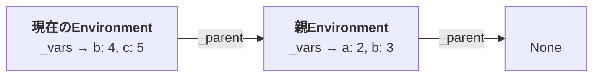
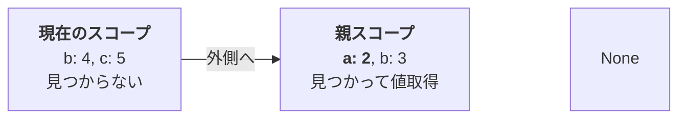
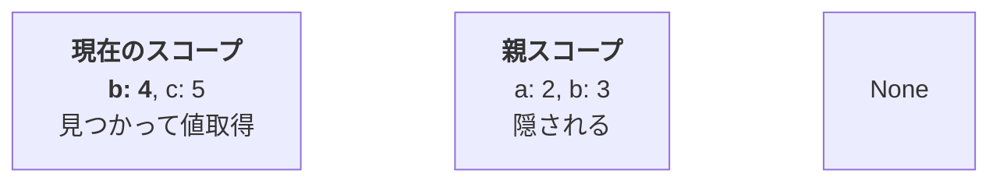
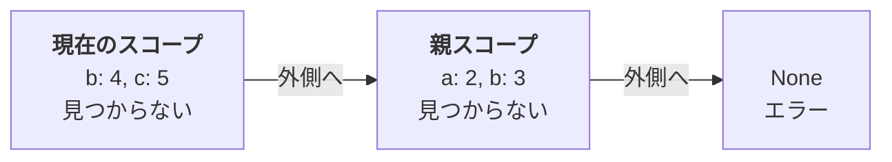
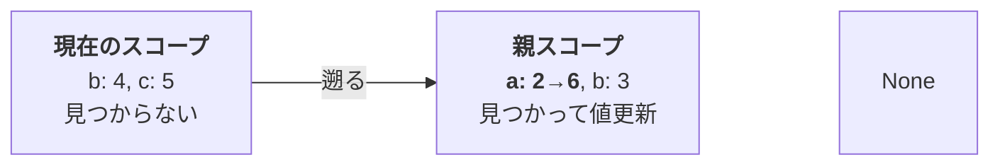
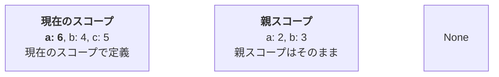

本節ではスコープと代入を導入します。

スコープとは変数をその外から見えないように閉じ込めた、ある範囲のことを言います。スコープも変数定義と同様 Python ではそれほど意識されていないかもしれません。というのは、Python には明示的にスコープを作る構文がないからです。

といっても Python にスコープが存在しないわけではなく、関数やメソッドを書くとスコープが作られます。

```py
>>> def foo(a): a += 1; b = 3
...
>>> a = 2; foo(a)
>>> print(a)
2
>>> print(b)
Traceback (most recent call last):
  File "<stdin>", line 1, in <module>
NameError: name 'b' is not defined
```

`foo()` の中の `a` はその外側で作られた `a` とは別物なので、`foo()` の内部で `a` を変更しても `foo()` の外の `a` には影響を与えませんし、`foo()` の中で作った `b` は `foo()` の外では見えません。このように、変数の有効な範囲を区切っているのがスコープなのです。

この後の節で関数を実装することになりますが、実はスコープと環境を組み合わせるだけで関数のしくみができてしまいます [^more-parts]。そういう意味では言語処理系の基礎をなすしくみのひとつだと言っていいでしょう。

[^more-parts]: 1 章の範囲では。3 章ではもうひとつ大事なしくみが必要になります。

一方、Java や JavaScript などの言語では `{}` で囲むとスコープができます [^javascript-scope]。
この構文を使ってもうすこしスコープの持つ性質を説明します。

[^javascript-scope]: JavaScript ではややこしいところもあるんですがとにかくできることはできます。

スコープの中にいるときは、外の変数が見えます。変数に値を代入すると、外の変数の値が変更されます。Python だと説明しづらいので JavaScript で。

```js
let a = 2
{
    console.log(a) // -> 2
    a = 3
}
console.log(a) // -> 3
```

スコープの中で変数を定義すると、スコープの中だけで有効な変数ができます。たとえ名前が同じであっても、その変数への代入はスコープの外の変数には影響しません。スコープの外からはスコープ内で定義した変数は見えません。

```js
let a = 2
{
    let a = 3
    console.log(a) // -> 3
    a = 4
    console.log(a) // -> 4
    let b = 5
    console.log(b)
}
console.log(a) // -> 2
console.log(b) // -> エラー
```

この例の `a` のように、内側のスコープで同じ名前の変数を定義して、外側の変数を見えなくすることを「シャドウイング」（Shadowing: 覆い隠し）と言います。

プログラムが大きくなると、どんな変数をどこで使っているか把握することが難しくなり、変数を変更したら思わぬところに影響が出た、ということが起こりやすくなります。スコープを利用して影響する範囲を区切って影響を局所的なものにすることにより、そのような影響が出ないようにすることができます [^use-function-not-scope]。

[^use-function-not-scope]: と言っても、明示的なスコープを入れないといけないとわかりづらい、という状態はもうすでに関数が大きすぎます。関数を分けましょう。

これを実現するために、`Environment` を親子関係でつなげられるようにします。そのために、`Environment` クラスに `_parent` プロパティを追加します。

```diff py
 class Environment:
-    def __init__(self):
+    def __init__(self, parent=None):
+        self._parent = parent
         self._vars = {}
```

`_parent` には親、つまり外側の環境を覚えさせます。`new_env = Environment(env)` として新しく環境 `new_env` を作ると、`new_env._parent` に `env` が記録されます。これは、`new_env` が外側の環境を知っているというわけで、変数 `a` を `new_env` で探してみたけど見つからなかった、というときには外側の環境を探しに行けるようになりました。逆に言うと、`new_env = Environment(env)` は `env` の内側に新しく `new_env` を作っている、とも捉えられます。

`def __init__(self, parent=None):` の `parent=None` は、引数が指定されていないときには `parent` を `None` とする、ということです。これにより、`Interpreter` クラスにある `self._env = Environment()` はそのままでもエラーにならず、このとき `self._env` の `_parent` は `None` になります。

`Interpreter` クラスの `self._env` は最上位（最も外側）の環境で、それより上の環境はないので、下位の環境から `_parent` をたどりつつ変数を探していき、`_parent` が `None` である環境でも変数が見つからなければその変数は定義されていなかった、ということになります。

次は代入（Assign）を見てみましょう。

```diff py
     def define(self, name, val):
         self._vars[name] = val
         return val

+    def assign(self, name, val):
+        if name in self._vars:
+            self._vars[name] = val
+            return val
+        elif self._parent:
+            return self._parent.assign(name, val)
+        else:
+            assert False, f"Undefined variable @ assign(): {name}"
```

変数定義と違うのは、代入ではすでに存在する変数の値を変更するというところです。変数定義（`define()`）の方は存在するかどうか気にせずそのまま値を設定していますね。

代入ではまず、変数を見つけなければいけません。`assign()` をぶった切りながら説明していきます。

```py
    def assign(self, name, val):
        if name in self._vars:
            self._vars[name] = val
            return val
```

`name in self._vars` は、`self._vars` のキーに `name` が含まれていれば `True` になります。
含まれているということは変数が見つかったということですので、`define()` の時と同様に値を設定し、またその値を返します。

続いて。

```py
        elif self._parent:
            return self._parent.assign(name, val)
```

`_vars` に `name` が含まれていなかった場合は `self._parent` が `None` かどうか確認します。`elif self._parent:` はちょっと省略した書き方で、`elif self._parent is not None:` とだいたい同じ意味です [^if-not-none]。つまり、まだ外側の環境があるということです。 なので、`return self._parent.assign(name, val)` でひとつ外側の環境で `assign()` します。

[^if-not-none]: なんでそうなるの？と思った方はちょっと戻って「コラム：Truthy と Falsy」を読んでみてください。

これもまた自分自身を呼んでいますので再帰の例となっています。 自分自身を呼ぶと言っても、環境をひとつずつ登っていきますので同じところを無限にぐるぐる回ることはなく、最悪でもいちばん外側までたどったらそこで終わります。

```py
        else:
            assert False, f"Undefined variable @ assign(): {name}"
```

`_vars` に `name` が含まれず、`self._parent` が `None` のときはここにたどり着きます。変数がなかったということですのでエラーで終了します。

代入ができましたが、これだけでは想定通りの動きになりません。スコープに狙い通りの動作をさせるには、変数を参照する方（`val()`）も同じように、変数が見つからなかったら外側の環境を探しに行くようにする必要があります。

変数があったときに値を設定するのではなく、値を返すということ以外は `assign()` と同じです。

```diff py
     def assign(self, name, val):
         ...

     def val(self, name):
-        return self._vars[name]
+        if name in self._vars: return self._vars[name]
+        elif self._parent:
+            return self._parent.val(name)
+        else:
+            assert False, f"Undefined variable @ val(): {name}"
```

`Environment` クラスでほとんどの仕事をやってしまうので `Evaluator` クラスでは適切に呼び出せばいいだけです。

```diff py
 class Evaluator:
     def eval(self, expr, env):
         match expr:
             ...
             case str(name): return env.val(name)
+            case ("scope", [body_expr]):
+                return self.eval(body_expr, Environment(env))
             case ("define", [name, expr]):
                 return env.define(name, self.eval(expr, env))
+            case ("assign", [name, expr]):
+                return env.assign(name, self.eval(expr, env))
             ...
```

変数の参照については `case str(name):` で処理しますが修正する必要はありません。

スコープを作る「式」（Java 等での `{ <body_expr> }` に相当）は `("scope", [body_expr])` という形としました。この形の式が来た場合、つまり `case ("scope", [body_expr]):` では `Environment(env)` で `env` の内側に新しく環境を作り、その環境内で `body_expr` を評価してその値を返します。

`case ("assign", [name, expr]):` のときは呼び出すメソッドが違うだけで `define` と同じ形ですね。

これでスコープ（と定義・代入）の性質を満たしていることを確認してください。

```py
    print("Scope and assignment:")

    toil.eval(("define", ["a", 2]))
    print(toil.eval(("assign", ["a", 3]))) # -> 3
    print(toil.eval("a")) # -> 3

    # print(toil.eval(("assign", ["b", 2])))
    # -> Undefined variable

    print(toil.eval(("scope", ["a"]))) # -> 3

    toil.eval(("scope", [("seq", [
        ("define", ["a", 4]),
        ("print", ["a"])
    ])])) # -> 4

    print(toil.eval("a")) # -> 3

    toil.eval(("scope", [("seq", [
        ("assign", ["a", 4]),
        ("print", ["a"])
    ])])) # -> 4

    print(toil.eval("a")) # -> 4

    toil.eval(("scope", [("seq", [
        ("define", ["b", 2]),
        ("print", ["b"])
    ])])) # -> 2

    # print(toil.eval("b")) # -> Undefined variable
```

特に、`scope` の中で `("define", ["a", 4])` しているときと `("assign", ["a", 4])` しているときの結果の差異に注目してください。

スコープの入れ子と `Environment` の親子関係が対応していることを意識すると動きが理解しやすくなると思います。図示しながら考えてみましょう。

このように変数とスコープを定義すると、

```py
("seq", [
    ("define", ["a", 2]), ("define", ["b", 3]),
    ("scope", [("seq", [
        ("define", ["b", 4]), ("define", ["c", 5]),
    ])])
])
```

このような環境ができます。外側のスコープ・内側のスコープと親 `Environment`・子 `Environment`（=現在の `Environment`）が対応づいていることを見てください。



ここで変数 `a` を参照しようとすると、現在のスコープには `a` が存在しないので、ひとつ外側のスコープを探しに行き、そこで `a` を見つけて値を取得します。



`b` を参照しようとすると、現在のスコープで見つかるのですぐに `b` の値を取得して返します。外側の `b` は隠されて見えなくなります（シャドウイング）。



`d` を参照しようとした場合、現在のスコープにも外側のスコープにも `d` が存在しないため、`_parent` が `None` になり、エラーとなります。



`a` への代入（`("assign", ["a", 6])`）を行おうとすると、現在のスコープには `a` が存在しないので、ひとつ外側のスコープを探しに行き、そこで `a` を見つけて値を更新します。参照の時とほとんど同じ動きですね。



`a` を定義（`("define", ["a", 6])`）しようとした場合、外側に遡ったりしないで常に現在のスコープで変数を定義します。結果として `a` が２か所で定義され、外側の `a` はシャドウイングされた状態になります。



どうでしょうか？

スコープが理解できたら関数を実装する準備は万端です。

ソース：https://github.com/koba925/toil-book/blob/0106_scope_assign/toil.py
差分：https://github.com/koba925/toil-book/compare/0105_var...0106_scope_assign
