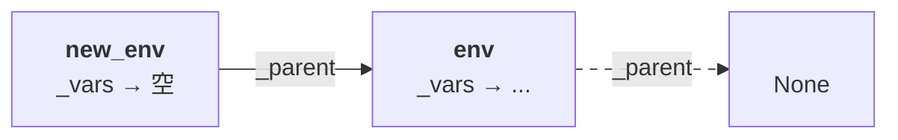
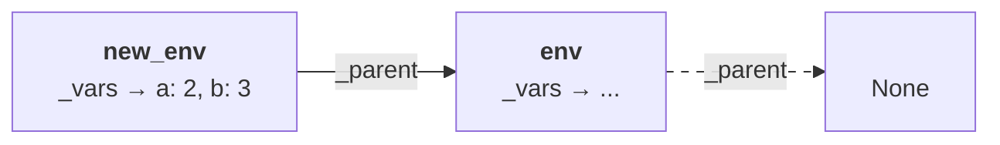

本書では組み込み関数ではなくてユーザが作る関数をユーザ定義関数と呼びます。Toil では、ユーザ定義関数の基礎を無名関数に置き、名前を付けるには変数を使います。っていうとなんか難しそうですかね。これ自体は読んでいけば大した話ではありませんので読み進めてください。

無名関数について前節の説明をさらっと復習します。

* `lambda a, b: a + b` は `a` と `b` を引数に取って `a + b` を返す関数
* `(lambda a, b: a + b) (2, 3)` のように、引数を渡して実行することができる（結果は 5）
* `myadd = lambda a, b: a + b` と変数に割り当てると `myadd(2, 3)` と呼び出せる

根っこは無名関数ですが名前を付けてやれば `myadd(2, 3)` のように呼び出せるのでプログラムは同じように書けます。

無名関数の式は `("func", [<仮引数の配列>, <本体>])` という形で書くことにします。`<本体>` は式ですが `<仮引数の配列>` はただ仮引数の名前が並んだ配列であることに注意してください。`a` と `b` ふたつの引数を取ってその和を返す関数、Python で言えば `lambda a, b: a + b` となる関数は `("func", [["a", "b"], ("add", ["a", "b"])])` です。

`("func", [<仮引数の配列>, <本体>])` を評価したときの「値」はそのまま `("func", [<仮引数の配列>, <本体>])` とします。`None` を評価した「値」が `None` であるのと同じようなものです。

```diff py
 class Evaluator:
     def eval(self, expr, env):
         match expr:
             case None | bool() | int(): return expr
+            case ("func", [params, body_expr]):
+                return expr
             case str(name): return env.val(name)
             ...
```

ユーザ定義関数の呼び出し[^function-application]は、組み込み関数の呼び出しと同じ形（`(<関数>, [<式>, <式>, <式>, ...])`）です。`(lambda a, b: a + b) (2, 3)` に相当するものは `(("func", [["a", "b"], ("add", ["a", "b"])]), [2, 3])` となります。だいぶ見づらくなってきましたが・・・

[^function-application]: 業界用語では関数呼び出し（Function call）のことを関数適用（Function application）と言うときもあります。動詞で言うときは関数を引数に適用する（Apply a function to arguments）、と言います。いまだにどっちをどっちに適用するのか覚えられません。すこーしニュアンスが異なりますが、本書のレベルでは気にすることはないでしょう。

そのため `eval()` ではユーザ定義関数と組み込み関数を区別せずに `_op()` を呼び出します。

`_op()` ではまず `op_expr` と `args_expr` を評価するところは同じですが、そのあと `op_val` の値が何なのかによって処理を変える必要があります。

```diff py
     def _op(self, op_expr, args_expr, env):
         op_val = self.eval(op_expr, env)
         args_val = [self.eval(arg, env) for arg in args_expr]
-        return op_val(args_val)
+        match op_val:
+            case f if callable(f): return f(args_val)
```

`case f if callable(f):` は新しいパターンです。`case f` は `op_val` がなんでもマッチして、`f` には `op_val` が入ります。新しいのは `if callable(f)` の部分で、`callable(f)` が真の時だけこの `case` がマッチします。なんとなく読んだ感じでわかるかなと思います。`callable(f)` は `f` が関数のように呼び出せるものなら真、そうでなければ偽です。`op_val` が組み込み関数であればその値は `lambda args: ...` のような関数ですので真になり、この `case` がマッチします。マッチしたら `return f(args_val)` を実行します。

`op_val` がユーザ定義関数 `("func", [<仮引数の配列>, <本体>])` という形であれば、これは Python にとってはただのタプルで、`callable` ではありませんのでこの `case` にはマッチせず、次の `case` に進みます。

```diff py
         match op_val:
             case f if callable(f): return f(args_val)
+            case ("func", [params, body_expr]):
+                new_env = Environment(env)
+                new_env.bind(params, args_val)
+                return self.eval(body_expr, new_env)
```

ユーザ定義関数（`("func", [<仮引数の配列>, <本体>])`）は `case ("func", [params, body_expr]):` にマッチし、`params` には `<仮引数の配列>` が、`body_expr` には `<本体>` が入って続くコードを実行します。

ユーザ定義関数の実行時に行われることは以下の三つです。

1. 関数のローカル変数のために新しいスコープを作る（`new_env = Environment(env)`）
2. 仮引数に指定された名前の変数を、実引数の値で定義する(`new_env.bind(params, args_val)`)
3. 関数の本体を評価する（`self.eval(body_expr, new_env)`）

`(("func", [["a", "b"], ("add", ["a", "b"])]), [2, 3])` を例にとってやってみましょう。

`case` に入った時点で `params` は `["a", "b"]`、`body_expr` は `("add", ["a", "b"])`、`args_val` は `[2, 3]` になっています。

ステップ 1 で `new_env = Environment(env)` すると環境は以下のようになります。



ローカル変数用のスコープを作ったら、次にステップ 2 で引数の処理を行います。ここで呼び出している `bind()` は `Environment` クラスに追加します。

```diff py
 class Environment:
     ...

     def val(self, name):
         ...

+    def bind(self, params, args):
+        for param, arg in zip(params, args):
+            self.define(param, arg)
```

`bind()` の `for param, arg in zip(params, args_val):` はふたつの配列から一つずつ取ってきては処理するときのイディオムです[^idiomatic-zip]。`zip(params, args_val)` は `params` の要素と `args_val` の要素を一組ずつペアにしたタプルの配列を作ります。

[^idiomatic-zip]: よく使われるイディオムなんですが弱点がありまして、配列の長さが違っていると、短いほうが終わったところで `for` も終わってしまいます。ということはつまり、Toil では仮引数と実引数の数が違っていると、長いほうは余ってしまうのです。その後どうなるかは神のみぞ知るです。まじめな言語を作るときはマネしないでちゃんと考慮しましょう。前節の注にも関連しますが、チェックしてエラーにするだけが対応方法ではありません。

`params` が `["a", "b"]`、`args_val` が `[2, 3]` なので `zip(params, args_val)` は `[("a", 2), ("b", 3)]` になります。`a` が `2` で `b` が `3`、と読めるでしょう。さきほどの `for` は `for param, arg in [("a", 2), ("b", 3)]` ということですね。繰り返しの 1 周目ではまず配列の先頭の要素 `("a", 2)` を `param, arg` に割り当てるので `param` が `"a"`、`arg` が `2` になります。その状態で `for` の本体（`new_env.define(param, arg)`）を実行するので、名前が `a` で値が `2` の変数ができます。2 周目では `params` が `"b"`、`arg` が `3` になって同様に名前が `b` で値が `3` の変数ができます。

この時点の環境は以下のようになっています。



その状態でステップ 3 を行います。`body_expr` つまり `("add", ["a", "b"])` を `eval()` するので `5` という値が返される、というわけです。

関数の呼び出しと言ってもそれほど特殊なことをしているわけではなく、スコープと変数と `eval()` の組み合わせにすぎないことがわかったでしょうか？

おっとまだ少し残ってました。

```diff py
+            case _:
+                assert False, f"Invalid operator @ _op(): {op_val}"
```

組み込み関数でもなく、ユーザ定義の関数の形もしていなければエラーにします。

実行例は個別に見ていきます。

```py
    print(toil.eval(("func", [["a", "b"], ("add", ["a", "b"])])))
    # -> ('func', [['a', 'b'], ('add', ['a', 'b'])])
```

`("func", [["a", "b"], ("add", ["a", "b"])])` を評価した値はそのまま `("func", [["a", "b"], ("add", ["a", "b"])])` です。

```py
    toil.eval(("define", ["myadd", ("func", [["a", "b"], ("add", ["a", "b"])])]))
    print(toil.eval(("myadd", [2, 3])))
    # -> 5
```

さっき解説したやつですね。

```py
    print(toil.eval(("myadd", [("myadd", [2, 3]), ("add", [4, 5])])))
    # -> 14
```

`args_val = [self.eval(arg, env) for arg in args_expr]` のように、関数の引数はまず評価されるので、関数の引数に関数呼び出しを書いてもちゃんと処理してくれます。この場合、`("myadd", [2, 3])` や `("add", [4, 5])` が先に評価されて `5` や `9` になり、そのあとで `5 + 9` が計算されます。

```py
    print(toil.eval((
        ("func", [["a", "b"], ("add", ["a", "b"])]),
        [2, 3]
    )))
    # -> 5
```

これは `(lambda a, b: a + b) (2, 3)` 的な書き方をしたものです。無名関数に名前を付けず、作ってその場で呼び出すのは、JavaScript 界隈では IIFE[^iife]と呼ばれ、一時は必須テクニックでした。

[^iife]: Immediately Invoked Function Expression（すぐに呼び出される関数式）。スコープを作るのに使われていました。今は `let` や `const` のおかげで（それほど）使わなくてもよくなっています。

```py
    print(toil.eval(("seq", [
        ("define", ["twice", ("func", [["f", "x"], ("f", [("f", ["x"])])])]),
        ("define", ["double", ("func", [["x"], ("mul", ["x", 2])])]),
        ("twice", ["double", 3])
    ])))
    # -> 12
```

Toil の関数は「ファーストクラス」なので、関数の引数にすることもできます。ここでは `twice` という与えられた関数を 2 回呼ぶ関数に、引数を 2 倍する関数の `double` を渡して、`3` の 4 倍を計算しています。

```py
    # toil.eval(("not_defined", []))
    # -> Undefined variable
    # toil.eval((2, [3, 4]))
    # -> Invalid operator
```

エラーの例。

次はちょっとややこしい例です。あたらしいスコープを作ったとき、外側の環境の変数も見えているというのを覚えていますか？だから関数の中からも外側の変数が見えています。

そのため、以下のコードは 2 を返します。`("func", [[], "a"])` は引数なしでただ変数 `a` の値を返すだけの関数です。関数の外で定義された `"a"` が見えています。

```py
    print(toil.eval(("seq", [
        ("define", ["a", 2]),
        ("define", ["f", ("func", [[], "a"])]),
        ("f", [])
    ])))
    # -> 2
```

このあとこういうコードを実行したとします。

```py
    print(toil.eval(("scope", [("seq", [
        ("define", ["a", 3]),
        ("f", [])
    ])])))
    # -> 3
```

今度は同じ `("f", [])` を実行したのに値が 3 になります。なぜでしょうか？

このとき環境はこうなっていて、`f()` を呼び出したスコープで `a` が見つかるので 3 を返します。親のスコープの `a` がシャドウイングされています。


ここではエッセンスだけ取り出したとても短いコードを見ているのでそんなに大変には思えないかもしれませんが、ちょっと変数の値を変えたら自分の知らない関数の動きが変わってしまうと思うとちょっと怖くありませんか？もし `f` が、3 か月前に書いた（またはほかの人が書いた）もっと複雑な関数で、今から `f` を呼び出したいとしたらどうでしょう？`f` を呼び出した時の `a` の値に影響を受ける、ということをちゃんと気にしながら使えるでしょうか？

ここで説明に使った例はやや極端に単純化したもので、もう少し普通にはこのように別の関数内（ここでは `g`）で関数をよぶことによりこういう状況が発生します。やっぱり 3 になります。関数 `f` を呼ぶ人は、変数 `a` の値によって `f` の結果が変わることを意識しておく必要があります。

これはある意味悪名高いグローバル変数が与える悪影響に近いものです。これは、動的スコープと呼ばれるしくみのせいなのです。

```py
    print(toil.eval(("seq", [
        ("define", ["a", 2]),
        ("define", ["f", ("func", [[], "a"])]),
        ("define", ["g", ("func", [[], ("seq", [
            ("define", ["a", 3]),
            ("f", [])
        ])])]),
        ("g", [])
    ])))
    # -> 3
```

以下次号！

ソース：https://github.com/koba925/toil-book/blob/0108_user_func/toil.py
差分：https://github.com/koba925/toil-book/compare/0107_builtin_func...0108_user_func
