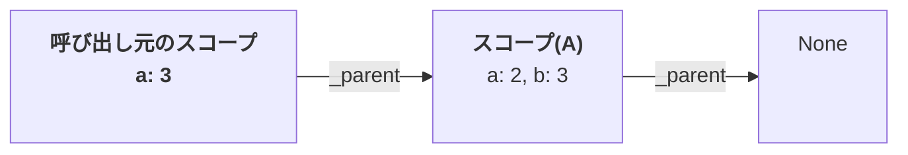
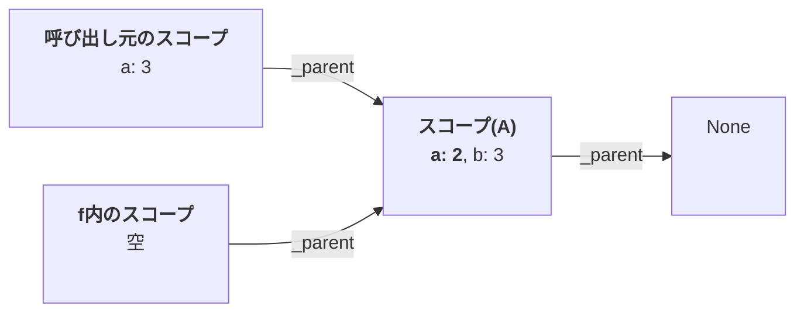
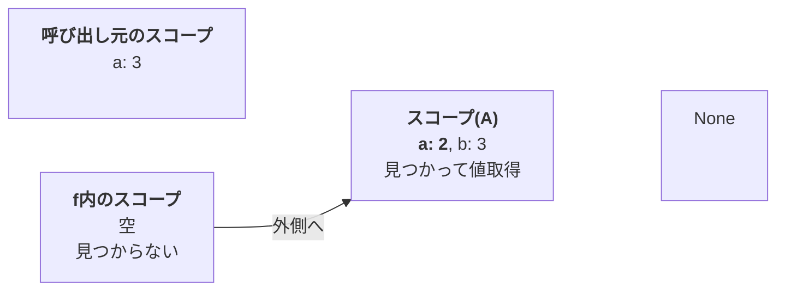

たぶんここが第 1 章最大の山場です。プログラムの修正はちょっとなんですけど。「クロージャ」ってよく聞くけどいまひとつピンとこない・・・というひとはこの節でピンとくるようになるかも！

さて、このコードを実行してから、

```py
    print(toil.eval(("seq", [
        ("define", ["a", 2]),
        ("define", ["f", ("func", [[], "a"])]),
        ("f", [])
    ])))
```

このコードを実行すると 3 が返ってきてしまってバグの元、というのが前節のラストでした。

```py
    print(toil.eval(("scope", [("seq", [
        ("define", ["a", 3]),
        ("f", [])
    ])])))
```

これは関数を作ったときと呼ばれた時で環境が違っているのが原因なので、関数を作ったとき、つまり `("define", ["f", ("func", [[], "a"])])` したときに関数とそのときの環境をセットで覚えておいて、関数を呼び出したときには覚えておいた環境の中で関数本体を実行するようにします。

```diff py
 class Evaluator:
     def eval(self, expr, env):
         match expr:
             case None | bool() | int(): return expr
             case ("func", [params, body_expr]):
-                return expr
+                return ("closure", [params, body_expr, env])
```

前節では関数の値は関数の式そのまま、つまり `("func", [params, body_expr])` でしたが、あとでこの時の環境を思い出せるように、`env` の情報を追加して `("closure", [params, body_expr, env])` を返すようにします。これが「クロージャ」と呼ばれているものの正体です。

`_op()` では `func` を受け取って処理していたところを `closure` を受け取って処理するようにします。

```diff py
     def _op(self, op_expr, args_expr, env):
         ...
         match op_val:
             case f if callable(f): return f(args_val)
-            case ("func", [params, body_expr]):
-                new_env = Environment(env)
+            case ("closure", [params, body_expr, closure_env]):
+                new_env = Environment(closure_env)
                 new_env.bind(params, args_val)
                 return self.eval(body_expr, new_env)
             case _:
                 ...
```

大事なのは `new_env = Environment(closure_env)` とクロージャに覚えていた環境から新たな環境を作っているところです。これによって、関数を作ったときの環境の中で関数本体を実行（`self.eval(body_expr, new_env)`）することができます。

`("func", [[], "a"])` を作ったときの環境はこうです。


`("closure", [params, body_expr, env])` の `env` はこの「現在のスコープ(A)」を指しています。

`f` つまり `("func", [[], "a"])` を呼ぶ直前の環境はこうです。



このときの `env` はこの図の「現在のスコープ」を指していますが、`new_env = Environment(closure_env)` で `("closure", [params, body_expr, env])` に記憶された環境すなわち(A)から `new_env` を作るため、どこから呼ばれたかに関係なく、さきほどのスコープ(A)の中に `f` のためのスコープが作られます。



この状況で関数本体を実行して `f` 内のスコープから `a` の値を探すと、スコープ(A)で見つかります。呼び出し元の環境とは関係なく、関数が作られた時の環境で実行されていますね。



実行例の前半は前節と同じです。以下の結果だけが違います。

```diff py
     print(toil.eval(("scope", [("seq", [
         ("define", ["a", 3]),
         ("f", [])
     ])])))
-    # -> 3
+    # -> 2

     print(toil.eval(("seq", [
         ("define", ["a", 2]),
         ("define", ["f", ("func", [[], "a"])]),
         ("define", ["g", ("func", [[], ("seq", [
             ("define", ["a", 3]),
             ("f", [])
         ])])]),
         ("g", [])
     ])))
-    # -> 3
+    # -> 2
```

静的スコープだとバグが出にくいということで話を進めてきましたが、利点はそれだけではありません。
関数を作る（＝`("func", ...)` を実行する）たびに新たにクロージャが作成され、その中に記憶された変数はその関数が捨てられるまでの間、その関数専用の変数として残り続けます。これがクロージャの強力なところです[^closure-merit]。

[^closure-merit]: あと、関数を呼ぶたびに毎回同じ環境で実行されることから高速化にも利用されます。

それを示す簡単な例として、カウンタを作ります。

```py
    print("Counter (Closure):")

    toil.eval(("define", ["make_counter", ("func", [[], ("seq", [
        ("define", ["count", 0]),
        ("func", [[], ("assign", ["count", ("add", ["count", 1])])])
    ])])]))
    toil.eval(("define", ["c1", ("make_counter", [])]))
    toil.eval(("define", ["c2", ("make_counter", [])]))
    print(toil.eval(("c1", []))) # -> 1
    print(toil.eval(("c1", []))) # -> 2
    print(toil.eval(("c2", []))) # -> 1
    print(toil.eval(("c2", []))) # -> 2
```

`make_counter` を呼んで作った `c1`・`c2` がそれぞれの `count` を持っていることがわかります。このことがクロージャの応用範囲を大きく広げています。

さて、動的スコープ・静的スコープと言ってきましたが、何が動的だったり静的だったりするのでしょうか。静的、っていうのはソースコードの時点（まだプログラムを動かしてないとき）にもう決まっててその後は変わらない、という意味で使われています。レキシカルスコープとも言います。レキシカルというのは語句とか語彙とかっていう意味で、字面で決まってる、くらいの意味です。動的スコープっていうのは動いてるとき、つまり実行中にやっとスコープが決まるっていうことです。

静的スコープだと関数を作ったときの環境を使い、動的スコープだと関数を読んだ時の環境が使われるので、個人的には生成時スコープ／実行時スコープって呼んだらもっとわかりやすいと思うんですけどね。

昔は動的スコープと静的スコープの間で宗教論争があったそうです。動的スコープ派にどういう言い分があったのかちょっとよくわかりません。今は動的スコープです！って言ってる言語は見ない気がします。ただ、あえて指定して動的スコープを作れる言語もありますので動的スコープにまったくいいところがないというわけではないはず（あえて呼び出し先の関数の動きを変えたいときとか）。

静的スコープを導入して、ユーザ定義関数の実装が完了しました。ユーザ関数の実装は実に大物で、実はここまででもう「なんでもできる」くらいの機能が備わっているのです[^turing-complete]。

[^turing-complete]: Turing complete（チューリング完全）と言います。

ですがあとひとつ作っておかないとなんか足りないと感じるひともいるのではないでしょうか？次の節で仕上げます。

ソース：https://github.com/koba925/toil-book/blob/0109_static_scope/toil.py
差分：https://github.com/koba925/toil-book/compare/0108_user_func...0109_static_scope

### コラム：global・nonlocal

やっとこれが説明できるようになりました。

> Pythonでは初めて使う変数でも `a = 2` などとなんの宣言もなく書き始められますが、これが変数の定義を兼ねています。便利なのは便利なのですが、副作用（しかも私があまり好きでない）もありましてToilでは定義と代入（定義済みの変数に値を設定しなおすこと）を分けています。

Python でも関数を入れ子にして定義することができます。

このように書いたとしましょう。あまり見慣れないひともいるかもしれませんが、`bar()` が `foo()` 専用の関数であればこう書いておくと `foo()` の外側から呼ぶことができなくなり、より安全になるという効果があります。局所関数などと言ったりします。

```py
def foo(a):
    def bar():
        a = 3
        print(a)

    bar()
    print(a)

foo(2)
```

実行すると何が表示されるでしょうか？3 と 2 が表示されます。当然、と思われる方が多いかもしれません。関数の入れ子などやったことがない、という方ならむしろそれが普通でしょう。

でも、ここまで Toil を実装してきた方の中には「ん？`a = 3` の `a` ってどっちのスコープの `a` なんだ？」と思われた方もいるかも。鋭い。

Python の `=` は Toil の `define` に対応していて、現在のスコープに変数を作ります。そのため、外側のスコープ（`foo()` の中）の `a` には影響を与えません。

では、`bar()` をこう書き替えたらどうなるんでしょうか。外側のスコープの `a` が `print` される？いえいえそうはなりません。

```py
def foo(a):
    def bar():
        print(a)
        a = 3

    bar()
    print(a)

foo(2)
```

`a` がない、というエラーになってしまいます。関数内に `a = 3` のような代入文があると、Python はこの関数内の `a` はローカル変数だ！と判断するようになっているため、`a = 3` より手前にある `print(a)` がエラーになるのです。わざわざ `UnboundLocalError` という別のエラーまで作って・・・（普通に変数がない時は `NameError`）。Toil で実装したような、現在のスコープにその変数がなければ外側のスコープを探しに行く言語に慣れていると、なんで！？と驚いてしまいます。

外側のスコープの `a` にアクセスしたいときは `nonlocal` を使う必要があります。

```py
def foo(a):
    def bar():
        nonlocal a
        print(a)
        a = 3

    bar()
    print(a)

foo(2)
```

これで Toil のスコープと同じように動くようになって、2 と 3 がプリントされます。

しかし、このように関数を入れ子にし、内側の関数で外側の関数と同じ名前の変数を使っているときはたいてい、外側の関数と変数を共有したいときなんですよね。なのにわざわざ `nonlocal` で 1 行書かされる。空行空けたければ 2 行も使う。そもそも `def bar(): a = 3` のように 1 行で書くことも認めてほしい派の筆者としてはこれはかなりのストレスです。せめて `nonlocal a = 3` みたいに書ければよかったんですけど。

というわけで「あまり好きではない」のでした。

前節の `make_counter` 関数も、Python ではこう書く必要があります。残念[^one-more-shame]。

```py
    def make_counter():
        count = 0
        def counter():
            nonlocal count
            count = count + 1
            return count
        return counter
```

[^one-more-shame]: このコードには `lambda` が複数行にわたって書けなくて `def` でわざわざ名前を付けて関数を作る必要がある、というもうひとつの Python の残念な点も現れています。`nonlocal` は文なのでそもそも `lambda` に書けないし・・・

諸悪の根源は、定義と代入を区別してないことなんですよね。というか代入がないというか。結局 `:=` なんていう演算子（代入演算子）も導入したわけだし、`:=` が定義、`=` が代入、みたいにしてくれてればなあ・・・と思いながら日々を過ごしております（大げさ）。

その思いが第 3 章で変数定義と代入の文法となって現れます。

似たものに `global` というのもあって、これは外側の `foo()` がない状態で使います。`global a` がないと、`print(a)` で `UnboundLocalError` になります。

```py
a = 2

def bar():
    global a
    print(a)
    a = 3

bar()
print(a)
```

グローバルな変数へのアクセスは局所的な変数のアクセスよりも注意深く行う必要があるのでこれはこれで仕方ない面もあるかな、と思うんですがこれを `foo()` の中に移動しようと思ったら `global` じゃだめで `nonlocal` に書き換えないといけないのです。

```py
def foo():
    def bar():
        nonlocal a
        print(a)
        a = 3
```

あーもう。全部 `nonlocal` でよくない？だめ？

ところで。

Python のスコープについては、`if` や `while` などの制御構造がスコープを作らないし自分でスコープを切ることもできなくて変数の有効範囲が広くなる、という批判もあるようですが個人的にはそれって関数を適切な大きさに保ってればそんなに問題ないんじゃね、って思ってます。

Toil は自分でスコープを切ることができるようにしていますが、制御構造が自動的にスコープを作ってしまうようにはしていません。そうすると `env` の段数が増えてしまってデバッグがやりにくくなる、っていう実務的な理由もあるんですけど。制御構造がスコープを作った方が安全で想定外の動きになりにくい、っていうのは確かにそうだと思います。それも関数が大きすぎなければだいぶ緩和されるのではないかと。

### コラム Toilのクロージャの弱点

以下のように、スコープに入れないで `a` を変更してしまうとこれは 3 が返ってしまいます。作ったときの環境を覚えているとはいえ、その環境の中の 2 が上書きされてしまっているので。

```py
    print(toil.eval(("seq", [
        ("assign", ["a", 3]),
        ("f", [])
    ])))
```

これを解決するにはいくつかの方法があります。

* そもそも変数の上書きを許さない
  これはいわゆる純粋関数型言語のアプローチですね。安全度は最高ですが、プログラムの書き方が違ってきます。自作言語入門の本を書くとき「変数の上書きがあるとこういう問題が出ます」と書く機会がなくなってしまいます。
* 環境のコピーを作ることによって、もとの環境に影響を与えないようにする
  クロージャに覚えておきたい変数は自分専用の環境にコピーを作っておくことにより問題を解決します。環境丸ごとコピーするのは大変なので、どの変数が必要なのか解析する必要があります。
* 処理系側で自動的にスコープを切る
  `for` や `if` などで自動的にスコープを作る言語では勝手に問題が解消してくれる場合もあります。完全ではありません。Javascript のように自動でスコープを作るわけではないけれども `{}` を使うことが多い言語もこの部類と言っていいでしょう。調べたわけではありませんがこのグループに入る言語が多い気がします。

Python や Toil ではどれもやっていないのでユーザが自分でスコープを切ってやることになります。Python は単独でスコープを作る機能もないので関数を分けたり他の手段を考えたりする必要があります。

`for` や `if` で自動的にスコープを作るようにするのは簡単で、`new_env = Environment(env)` してやればいいのですが `env` の段数が増えてデバッグ時に見づらいというのもあって Python に寄った仕様にしています。
