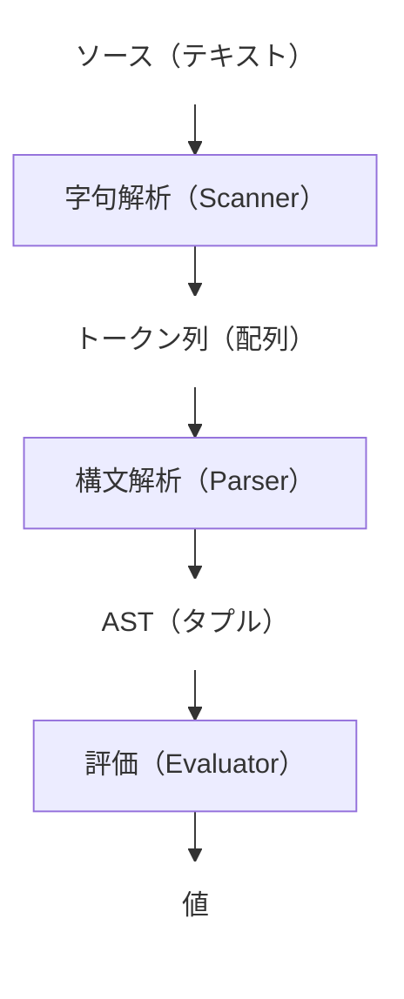

これまでに作った `scan()`（字句解析）、`parse()`（構文解析）、`eval()`（評価）の 3 つの処理をつなぎ、テキストのソースコードが実行できるインタプリタに仕立て上げます。



もうパーツはそろっていますので `Interpreter` クラスでそれらを組み合わせるだけです。

```diff py
 class Interpreter:
     ...

     def scan(self, src):
         return Scanner(src).tokenize()
 
     def parse(self, tokens):
         return Parser(tokens).parse()
 
+    def ast(self, src):
+        return self.parse(self.scan(src))
+
     def eval(self, expr):
         return Evaluator().eval(expr, self._env)
 
+    def walk(self, src):
+        return self.eval(self.ast(src))
```

`ast()` で `scan()` と `parse()` を組み合わせてソースコードを AST にし、`walk()` で `ast()` が出力した AST を `eval()` に与えて評価しています。

なお、`walk()` というのはインタプリタを実行する動詞としてはあまり一般的ではありません。この本が第 2 章で終わるなら `run()` とするところですが・・・

実行例です。

```py
    print("Interpret numbers:")

    print(toil.walk(r"""2"""))  # -> 2
    print(toil.walk(r"""02"""))  # -> 2
    print(toil.walk(r"""23"""))  # -> 23

    # print(toil.walk(r"""$"""))  # -> Invalid character
    # print(toil.walk(r"""2$"""))  # -> Invalid character
    # print(toil.walk(r""""""))  # -> Invalid token
```

結果は説明不要でしょう[^no-unit-tests]。

[^no-unit-tests]: しいて何か書くなら `toil.parse([2, 34, "$EOF"])` が `Extra token` というエラーになることに対応する実行例は `walk()` にはありません。`parse()` がエラーになるので `scan()` → `parse()` → `eval()` という流れが途切れてしまうからです。何を言いたいかというと `walk()` のテストだけではテストのカバレッジが 100% にはならないということです。Toil のテストコードは基本的に `walk()` のような End-to-end のテストで、メソッドごとのユニットテストは書いていませんので、実はテストされないルートもあります。

（例によってほんのささいなことしかできませんが）ソースコードを読んで実行するインタプリタの骨組みができました。ここから先は、この骨組みの上に機能を追加していきます。

ソース：https://github.com/koba925/toil-book/blob/0203_interpreter/toil.py
差分：https://github.com/koba925/toil-book/compare/0202_parse_numbers...0203_interpreter
